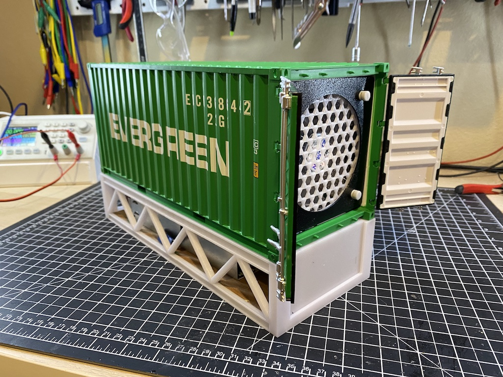
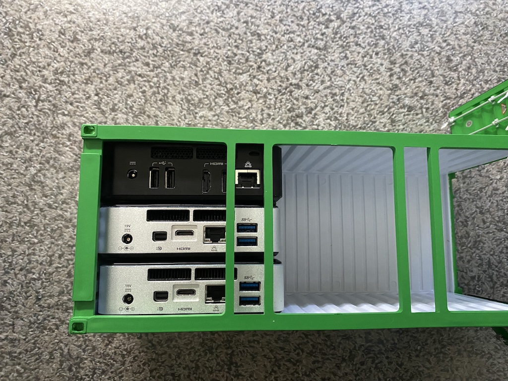
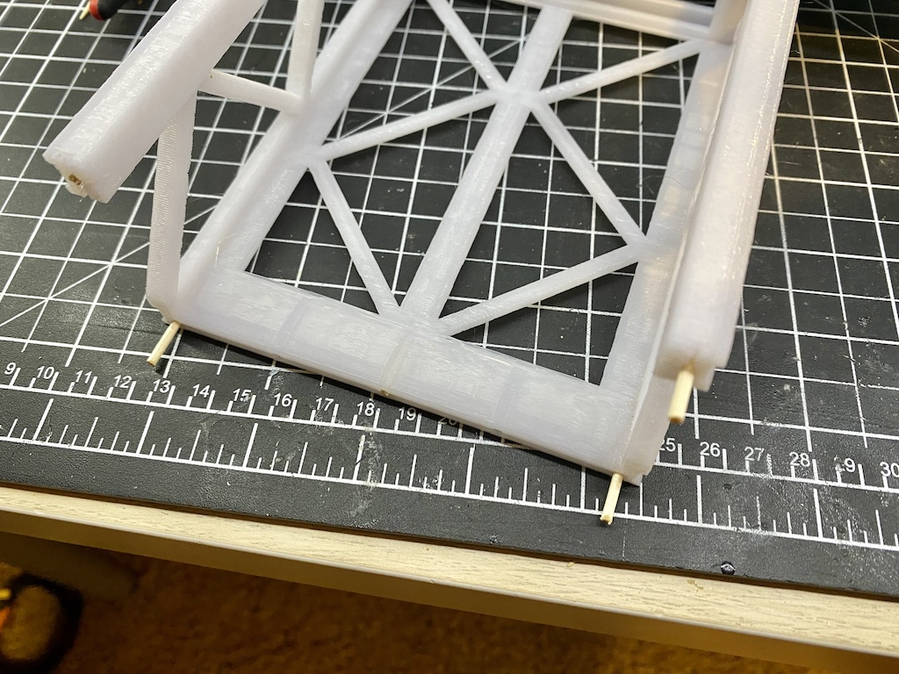
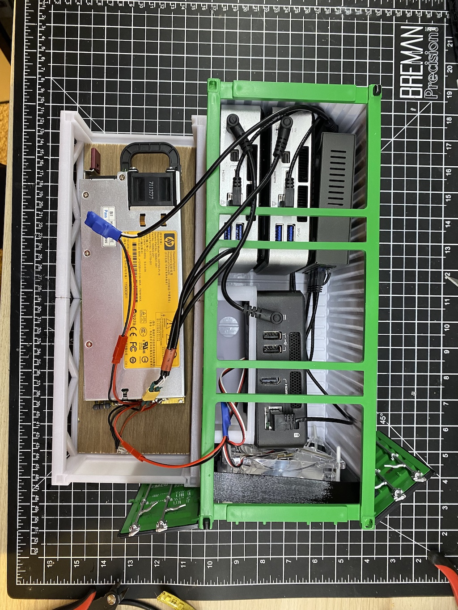

# Shipping container docker

Run a k8s inside a 1/20 scale shipping container.

These 1/20 scale shipping containers from aliexpress can comfortably hold 6 intel NUC or a variety of raspberry pis.

Additional images in the [pictures](./pictures) directory

## Parts

| Name | Link|
| --- | --- |
| 1/20 scale Shipping container | https://www.aliexpress.com/item/1005001604891498.html?spm=a2g01.12616982.tplist001.3.559b601cIaYDpL&pdp_ext_f=%7B%22sku_id%22:%2212000016984381242%22,%22ship_from%22:%22CN%22%7D&gps-id=5950812&scm=1007.23961.125497.0&scm_id=1007.23961.125497.0&scm-url=1007.23961.125497.0&pvid=bc45ca91-c715-4567-b9ae-1494fef304e0 |
| 1/20 container alternate link | https://www.vicmodel.com/product-page/1-20-scale-shipping-container-scale-model| 
| 92mm fan | https://www.amazon.com/gp/product/B00NMXE90E/ref=ppx_yo_dt_b_asin_title_o03_s00?ie=UTF8&psc=1 |
| Slim Cat6 Cables | https://www.amazon.com/gp/product/B076PKMQLH/ref=ppx_yo_dt_b_asin_title_o02_s00?ie=UTF8&psc=1|
| Cat 6 couplers| https://www.amazon.com/gp/product/B09F9C8DB1/ref=ewc_pr_img_1?smid=A2TSO014VPJ13Z&psc=1|
| 5.5 x 2.5 mm DC plug | https://www.amazon.com/gp/product/B08Z6WWGV7/ref=ppx_yo_dt_b_asin_title_o01_s00?ie=UTF8&psc=1| 
| 5v buck converter | https://www.amazon.com/gp/product/B0758ZTS61/ref=ppx_yo_dt_b_search_asin_title?ie=UTF8&psc=1| 
| JST Connectors | https://www.amazon.com/gp/product/B013WTV270/ref=ppx_yo_dt_b_search_asin_title?ie=UTF8&psc=1|
| XT30 connectors | https://www.amazon.com/10Pairs-Upgrade-Connector-Female-Battery/dp/B08P5HVMYT/ref=sr_1_5?keywords=xt30&qid=1639361252&sr=8-5 |
| Socket Switch (optional)| https://www.amazon.com/gp/product/B078PFFL46/ref=ppx_yo_dt_b_search_asin_title?ie=UTF8&psc=1| 

## 3d Printed Parts

- Base (PLA/PETG)
- Backplate (PLA/PETG)
- Frontplate (PLA/PETG)
- Fan Holder (TPU)

(Optional)
- [Netgear 305 Nuc Adapter](https://www.thingiverse.com/thing:5155376)
- [Raspberry Pi NUC Adapter](https://www.thingiverse.com/thing:3704304)

## Assembly

1. Remove the 6 small screws holding the wood base in place
2. Print out the fan in TPU (optional)
3. Print out the remaining parts in PLA/PETG

The base plates are likely too large for your 3d printer. Print 2 halfs of the base then use glue and wooden toothpicks to hold together.

4. Power

I used a 750 watt HP power supply. However this is unnecesary since you can directly power intel nuc/ raspberry pi from the wall. 

The HP switch and fan are dropped from 12v to ~5v using the buck converters. The buck converers are good for about 1 AMPS without a heatsync.

